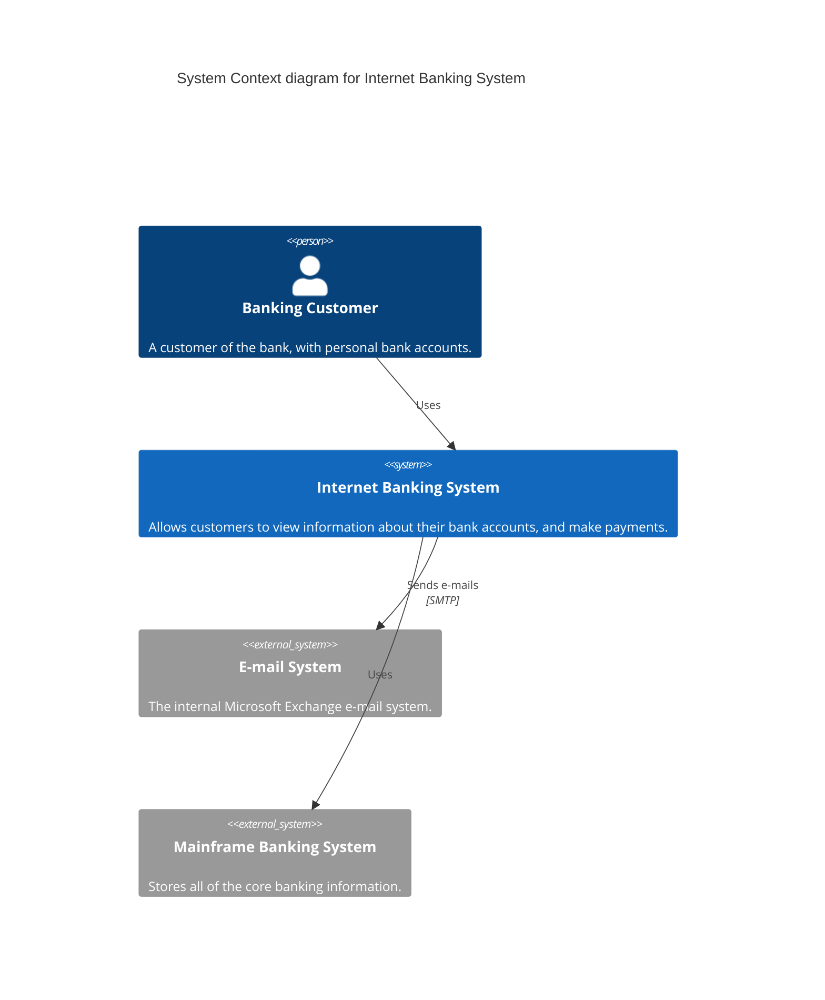

# C4 Architecture Skill

## Quando usar esta habilidade
- Para documentar a arquitetura de um software de forma estruturada.
- Para explicar o sistema para diferentes audiências (Stakeholders, Arquitetos, Devs).
- Para diagramar interações complexas.

## O Modelo C4 (Context, Containers, Components, Code)

### Nível 1: Contexto (Context)
- **Audiência**: Todo mundo (Técnicos e Não-técnicos).
- **Foco**: O "Big Picture". O sistema e seus relacionamentos externos (Usuários, Sistemas de Pagamento, Email Service).
- **Diagrama**: "Caixa preta". O sistema é uma caixa no meio.

### Nível 2: Containers (Containers)
- **Audiência**: Arquitetos e Desenvolvedores.
- **Foco**: Aplicações deployáveis e armazenamento de dados.
- **Exemplos**: "API Backend", "SPA Frontend", "Mobile App", "Database", "File System".
- **Nota**: Container aqui NÃO É Docker. É uma unidade de deploy.

### Nível 3: Componentes (Components)
- **Audiência**: Desenvolvedores.
- **Foco**: Dentro de *um* Container, quais são as partes principais?
- **Exemplos**: "AuthController", "AuditService", "PaymentRepository".
- **Diagrama**: Mostra como os componentes interagem.

### Nível 4: Código (Code)
- **Audiência**: Desenvolvedores (raramente necessário desenhar).
- **Foco**: Diagramas de Classe UML, ERD.
- **Dica**: Geralmente é detalhe demais. Use apenas para partes críticas e complexas.

## Sintaxe com Mermaid

